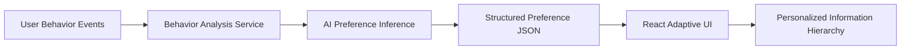

# Adaptive UI

> **同一件商品，不同的決策優先順序。**

Adaptive UI 是一個 AI 驅動的資訊優先排序介面（information prioritization interface）。它從使用者可觀察到的瀏覽與互動行為，推論使用者在當下購買決策中較重視的資訊，再調整商品頁的 information hierarchy。

**Stable navigation. Adaptive emphasis.** 操作位置保持穩定，只調整哪些資訊應該被優先看見。

## Demo

🎥 Demo Video: [待補 Demo 影片連結]

🌐 Live Demo: [待補部署網址]

## Demo Flow

```text
01 觀察行為
        ↓
02 推論偏好
        ↓
03 調整介面
```

目前 Demo 以同一件商品展示三種 synthetic persona：

| 使用者 | 主要偏好 | 優先呈現 |
| --- | --- | --- |
| Alex | 價格導向 | 價格、折扣、優惠券、運費、賣家比較 |
| Jamie | 信任導向 | 評價、買家照片、退貨政策、賣家可信度 |
| Taylor | 規格導向 | 電池續航、相容性、重量、Bluetooth、技術規格 |

Demo 最後提供 **Comparison Summary**，比較同一商品在不同資訊優先順序下的呈現；也可在商品頁切換 Default / Adaptive View。

## Problem

多數電商網站即使面對不同使用者，仍以相同的資訊層級呈現商品。但人們在購買決策中重視的資訊可能完全不同：價格、折扣與運費；評價、負評與退貨；或規格、相容性與技術細節。

現有個人化常聚焦在「推薦什麼商品」。Adaptive UI 處理另一個問題：**當使用者已經在看同一件商品時，哪些資訊應該更容易被他看到？**

## Solution

Adaptive UI 將個人化從 Content Recommendation 延伸到 **Information Prioritization**：

```text
Observed behavior
  → AI preference inference
  → Structured preference profile
  → Frontend adaptive rendering
```

前端只調整：

- card prominence
- typography hierarchy
- information ordering
- expanded details
- contextual summary

同時保持 navigation、core CTA 與基本操作位置不變。

> **介面位置保持熟悉，資訊重點因人而異。**

## Why AI?

這不是「點價格五次就放大價格」的單一規則。使用者可能同時比較賣家、查看優惠券與運費、閱讀負評，或檢查規格；AI 的角色是理解這些混合 behavioral signals，推論當前主要的 information preference，而不是僅對單一點擊套用規則。

| 責任 | 做什麼 |
| --- | --- |
| AI / inference layer | 理解 behavioral signals 的語意，產生 primary preference、confidence 與有依據的 reasoning |
| Frontend | 根據 structured JSON 調整 UI，保持 navigation 穩定，控制安全且可預測的 rendering |

> **AI decides what information matters more.**  
> **The frontend decides how to present it safely.**

## Not a Recommendation System

| | Recommendation System | Adaptive UI |
| --- | --- | --- |
| 個人化的對象 | **WHAT** you see | **HOW** information is prioritized |
| 例子 | 推薦另一件商品 | 讓既有商品頁的價格、信任或規格更突出 |

兩者可以共存；Adaptive UI 不取代商品推薦，而是改善使用者已進入商品頁後的決策資訊路徑。

## UX Principle

### Stable Navigation

保持 navigation、core actions、purchase CTA 與 fundamental page structure，避免使用者每天都像進入完全不同的網站。

### Adaptive Emphasis

只調整 card prominence、font hierarchy、information priority 與 expanded details，降低認知負擔，同時讓重要資訊更早被看見。

## Target Users

這個 Hackathon prototype 以 e-commerce product page 呈現，因為它最容易視覺化展示「同一資訊、不同決策優先順序」。概念未來可探索的場景包括：

- B2B SaaS dashboards
- Financial dashboards
- Enterprise operations tools
- Analytics platforms
- Decision-support systems

這些是 potential applications，並非本 prototype 已完成或驗證的產品範圍。

## Data & Privacy

本 Hackathon prototype 使用 **synthetic behavioral data**，不是 Shopee 或任何真實電商平台的使用者資料。這讓 Demo 可重現、能模擬不同 decision patterns，並避免使用真實個資來驗證 preference inference pipeline。

AI 應只推論 **current information preference**；不應推論年齡、性別、收入、人格、身分或任何敏感屬性。未來 production version 的目標資料流是：

```text
Consented first-party behavioral events
  → inference service
  → adaptive interface
```

在收集或處理 production data 前，仍須定義 consent、retention、access、security 與 contract versioning。

## Unknown-user Validation

為避免 `Alex = price`、`Jamie = trust`、`Taylor = specs` 只是 hard-coded persona，repo 另外包含沒有 preference label 的 `unknown_01` 與 `unknown_02` request fixtures：[`src/data/unknownUsers.ts`](src/data/unknownUsers.ts)。

AI input 只包含 raw behavior events，不包含 expected preference、persona、demographics 或其他推論欄位。預期結果與檢查規則則獨立記錄在 [`docs/ai-contract.md`](docs/ai-contract.md)，因此驗證時只將 request object 送至 inference service，再以回傳的 style、範圍與 grounded reasoning 比對。

簡短的輸入形式如下：

```json
{
  "user_id": "unknown_01",
  "events": [
    { "action": "open_reviews", "target": "reviews" },
    { "action": "check_return_policy", "target": "return_policy" }
  ]
}
```

## Architecture



### Frontend

- React
- Vite
- TypeScript

The integration boundary is [`src/services/analyzeBehavior.ts`](src/services/analyzeBehavior.ts). The frontend and inference layer are separated, so a future backend adapter can replace the mock implementation without requiring presentation components to call an API directly. The request/response contract is documented in [`docs/ai-contract.md`](docs/ai-contract.md).

## Current Prototype Status

Implemented in this repository:

- User Behavior activity feed with three synthetic decision patterns
- Three-stage demo flow: behavior observation, preference profile, adaptive product UI
- Preference Profile with scores, primary preference, confidence, and reasoning
- Default / Adaptive product-page comparison
- Value-focused, trust-focused, and specs-focused information hierarchy
- Comparison Summary for the same product across all three personas
- Synthetic behavioral datasets and unlabeled unknown-user fixtures
- AI input / output contract and a narrow frontend integration boundary
- Traditional Chinese demo UI and responsive desktop-to-tablet layout rules
- Production build script (`npm run build`)

### AI integration status

> **Stable frontend Demo currently uses mock inference. Live AI backend integration is in progress.**

More precisely, `analyzeBehavior` currently waits briefly and returns the supplied display profile deterministically. The backend-facing raw request/structured response types and validation contract are present, but no `fetch`, endpoint, API key, database, or direct component-level backend integration is implemented in this prototype.

## Project Structure

```text
adaptive-ui/
├── docs/
│   └── ai-contract.md             # Inference input/output and validation boundary
├── src/
│   ├── components/                # Demo stages and adaptive product UI
│   ├── data/
│   │   ├── mockData.ts            # Product and named demo personas
│   │   └── unknownUsers.ts        # Unlabeled raw-behavior validation fixtures
│   ├── services/
│   │   └── analyzeBehavior.ts     # Deterministic mock / future API seam
│   ├── App.tsx                    # Demo orchestration
│   ├── main.tsx
│   ├── styles.css
│   └── types.ts                   # UI and inference contract types
├── index.html
├── package.json
└── vite.config.ts
```

## Run Locally

### Requirements

- Node.js
- npm

### Install and run

```bash
git clone https://github.com/2007ANSON/adaptive-ui.git
cd adaptive-ui
npm install
npm run dev
```

### Production build

```bash
npm run build
```

If Windows PowerShell blocks `npm.ps1` because of execution policy, use:

```powershell
npm.cmd install
npm.cmd run dev
```

## Prototype Limitations

The prototype deliberately does not yet include:

- Real e-commerce platform data integration
- Production user accounts
- Long-term preference learning
- Production event pipeline
- Large-scale A/B testing
- Production privacy / consent infrastructure
- Large-scale model calibration
- Complete accessibility validation

目前 prototype 的目標是驗證：

> 使用者行為能否被轉換成資訊偏好，並進一步調整介面的資訊優先順序。

## Next Steps

1. Connect a live AI inference backend behind the existing service boundary.
2. Validate unlabeled unknown-user fixtures against the contract.
3. Run larger usability tests.
4. Measure time-to-information and clicks-to-decision.
5. Test confidence-based adaptation strength.
6. Explore non-commerce applications.

## Core Idea

> **Every user decides differently.**  
> **Why should every interface prioritize the same information?**

**Same product. Different decision priorities.**
